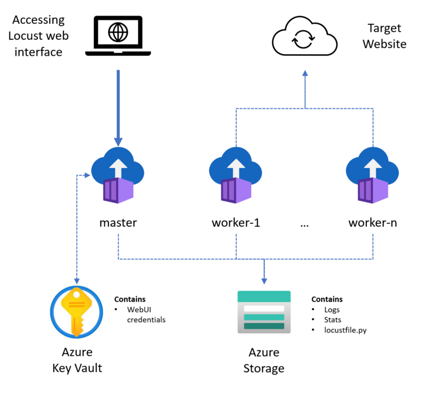
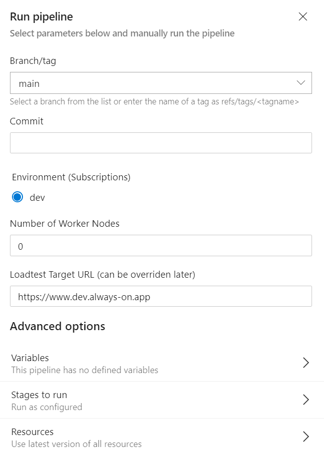
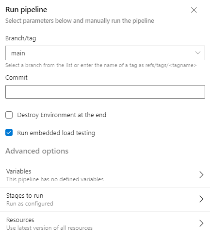
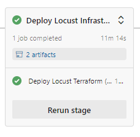
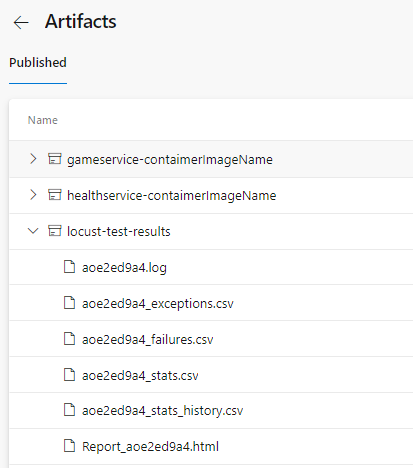
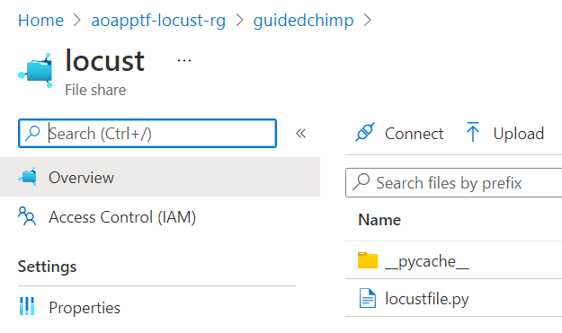
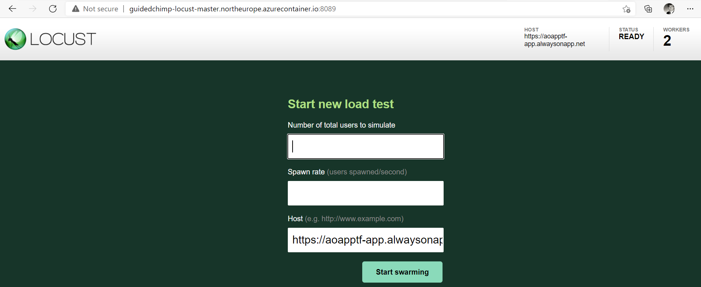
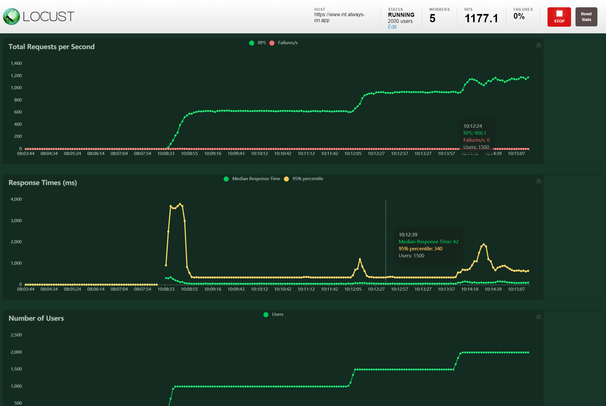

# Load Testing with Locust

[locust.io](https://locust.io) is an easy to use, scriptable and scalable open source load and performance testing tool.

The Azure Mission-Critical reference implementation leverages Locust in two different ways:

* **Embedded** is used to automatically run load tests as part of the end-to-end (e2e) validation pipeline using a fixed set of parameters. This is intended to compare each e2e run (currently manually) and the changes that were made against a given performance baseline.

* **Standalone** is a separate pipeline that spins up a Locust deployment with a WebUI to conduct customized load tests on-demand.

## Infrastructure

The standalone as well as the embedded Locust implementation used for the Azure Mission-Critical reference implementation consists of one master node and one or more worker nodes distributed across multiple Azure regions. The worker nodes execute the load testing tasks and communicate with the master node on port `5557/TCP`. The master node is orchestrating the worker nodes, gathering the load test data and (in standalone-mode only) hosting a web interface on port `8089/TCP` to conduct and monitor load tests.

All nodes are represented as individual container instances, hosted on Azure Container Instances (ACI) and are deployed via Terraform. The Terraform definition is stored in the `src/infra/loadtest-locust` directory.

### Standalone

The standalone environment can be scaled-up and down via the **Azure.AlwaysOn Deploy Locust (standalone)** pipeline in Azure DevOps. The number of worker nodes can be defined for each individual pipeline run:

To scale the infrastructure down you can simply execute the pipeline with "Number of Worker Nodes" set to zero. Setting the number of workers to `0` will tear down all workers and will remove the master node as well.

Further configuration changes can by done by modifying the `variables.tf` file. Here are the most relevant configuration options:

* `locust_worker_locations` is a list of datacenter regions the workers will be spread across
* `locust_version` contains the locust image and tag e.g. `locustio/locust:2.2.2`

The additional infrastructure consisting of an Azure Storage Account hosting the `locustfile.py` test definition as well as an Azure Key Vault hosting the randomly generated password used to access the locust web interface. Those two resources will remain, even if the Locust workers are scaled down to zero.

Check out [Globally distributed load tests in Azure with Locust](https://medium.com/microsoftazure/globally-distributed-load-tests-in-azure-with-locust-aeb3a365cd60?source=friends_link&sk=af2c76b46c2cfebd4c972106c9ecbadc) to learn more about Locust on ACI.

### Embedded

The embedded version of Locust is "embedded" into the **Azure.AlwaysOn E2E Release** pipeline and can be enabled by selecting "Run embedded load testing" when running the pipeline.

This results in an additional pipeline stage:

And uploads the load test results at the end at the end of each successful run as pipeline artifacts:

## Authentication

Some of the REST methods on the Azure Mission-Critical sample workload API are protected with API key-based authentication. In order to call the API and run tests, Locust needs to present the `X-API-Key: XXX` HTTP header. The corresponding value can be fetched from of of the Azure Key Vault of the deployment (it is the same key between all the stamps).

## Load Testing

All tests are defined in the [`locustfile.py`](./locustfile.py) Python file. They're defined as a sequence of API calls which represent typical user actions in the application.

Locust supports weight specification on individual tasks, so the test is configured in a way that sending new ratings is more frequent than typing text-based comments, to reflect realistic usage pattern.

The `locusfile.py` Python file is automatically uploaded into the File Share of a dedicated Azure Storage Account:

From there it is mounted into the worker and master container instances:

Here an example with one master and two worker containers:

## Locust Web Interface

The locust web interface is only available in the Standalone-version, it is hosted by the master container instance on port `8089`. It is protected with basic web-auth, the password is randomly generated and stored in Azure Key Vault. Our pipeline will return the public DNS FQDN of our master node at the end of each successful pipeline run.

> **Important!** To login to the locust web interface, you have to retrieve the password from Azure Key Vault. The **username** is always **locust**.

It allows you to specify a **Number of total users to simulate** as well as the **Spawn rate** (users spawned/per second).

---

[Back to documentation root](/docs/README.md)
